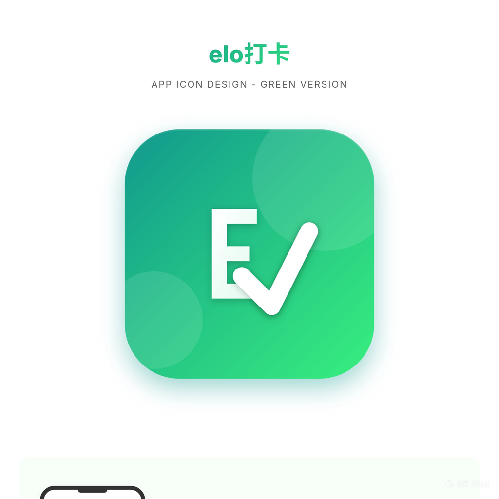

# elo 打卡 · 项目笔记与完整文档

> 一个以"个人自我管理"为核心的打卡小程序/App。
> 从 HTML 高保真原型 → uni-app 前端 → Node 后端 → Sealos 线上部署 → 微信体验版 → Android APK，完整走通。

---

## 1. 项目一句话

**elo 打卡**：帮助自己坚持小目标（学习、早睡、运动、自定义习惯）的个人自我管理工具。
设计风格：绿色渐变 + 简洁清爽；核心体验是"主页一屏打卡、统计可见进步"。

---

## 2. 当前状态（2026-09-08）

| 项目 | 状态 | 地址/说明 |
| --- | --- | --- |
| GitHub 仓库 | ✅ v1.0.3 已发布 | https://github.com/hywwz/elo-checkin |
| 后端（Sealos） | ✅ 运行中，更新接口已上线 | https://cywspqlnlffd.cloud.sealos.io |
| Android App | ✅ v1.0.3 正式发布（com.elo.checkin / targetSdk 34） | APK 与更新地址见下方 v1.0.3 摘要 |
| 微信小程序 | ⏸ 不再继续开发，未来只做 Android App | 保留体验版 v1.0.1 |
| 本地代码 | ✅ 干净可构建 | master 分支（v1.0.3） |
| 接口文档 | ✅ | [backend-api.md](backend-api.md) |

---

### v1.0.1 变更摘要

- 登录页“记住密码”改为固定密钥 AES 加密存储，退出登录后可回显真实密码
- 新增“账号与安全”页：旧密码校验修改密码、显示/隐藏密码、退出登录
- 打卡主页右上角新增账号/安全入口
- 管理员（默认账号：`测试1`）：用户列表、查看目标完成与打卡记录、重置密码、删除用户
- 登录页“忘记密码”改为“联系项目管理员”提示
- 后端新增 `/auth/change-password`、`/auth/logout` 与管理员接口
- App 正式图标：采用 E + 打勾 设计稿（源图 a5ea，1024×1024），生成 Android 各分辨率图标并写入 manifest
- App 内更新检查：后端 `GET /app/update` 返回最新版本与下载地址，App 启动时自动检测新版并引导下载

### v1.0.2（开发中）变更摘要

- 更新检查提前到登录页启动触发，未登录也能收到新版提示；“账号与安全”页新增“检查更新”手动入口
- 版本号统一管理：前端版本常量收口到 `src/utils/app-update.js`，与 `manifest.json`、`server/app-update.js` 同步维护
- 文档补全：`backend-api.md` 登记 `/v1/app/update`；记录 box-sizing 输入框宽度坑
- 根目录过程稿（原型 HTML / 图标对比图）归档到 `archive/`，主目录保持清爽
- 发布约定：标签发布后不移动，后续改动用新版本号推进
- 新增新手文档：部署全流程解析 `DEPLOY-GUIDE.md`、模板框架提炼 `TEMPLATE-GUIDE.md`

### v1.0.2 / v1.0.3 发布摘要（2026-09-08）

- 正式 App 改为源码工程 + DCloud AppID `__UNI__19AE649` 云打包，Android 包名 `com.elo.checkin`，targetSdkVersion 34
- 自研本地定时通知 UTS 插件 `elo-notify`：立即通知 / 指定时间通知 / 取消 / 权限检查 / 跳转系统设置
- 三类系统提醒接入 App：按时提醒（按目标提醒时间）、风险提醒（当天 22:00 未打卡）、成就提醒（连续 7 / 30 / 100 / 365 天）
- “账号与安全”新增「系统提醒」开关：风险提醒、成就提醒可独立关闭
- 打卡主页每次加载/打卡后自动重排未来 30 天提醒（最多 450 条闹钟，避免超过系统上限）
- v1.0.3 修复：
  - 提醒时间改为系统原生双列滚轮（不再出现滚轮对不准、需手动对准绿框的问题）
  - 目标名称 / 具体任务输入框补 `box-sizing: border-box`，与下方频率、时间框对齐
  - “账号与安全”页「退出登录」与上方卡片拉开间距（`margin-top: 44rpx`）
  - “检查更新”在接口异常时提示“后端更新服务尚未生效”；下版增加“当前已是最新版本”反馈

### 2026-09-08 踩坑记录与解决方案

| # | 问题现象 | 根因 | 解决方案 |
| --- | --- | --- | --- |
| 1 | UTS 插件云打包 Kotlin 编译失败 | `BroadcastReceiver` 子类缺少显式 `super()`；权限写法需用 UTS 数组字面量 | 补构造方法；权限改 `[Manifest.permission.POST_NOTIFICATIONS]` |
| 2 | 请求通知权限报 targetSdk 必须 ≥33 | 旧自定义基座 targetSdk=28 | `requestNotificationPermission` 增加 targetSdk<33 直接按已开启处理；正式包 targetSdkVersion=34 |
| 3 | 通知发不出来：`no valid small icon` | 通知没设置小图标 | `builder.setSmallIcon(context.getApplicationInfo().icon)` |
| 4 | 提醒通知被勿扰降级成静默进通知栏 | 通知没有 REMINDER 类别 | `builder.setCategory(Notification.CATEGORY_REMINDER)` |
| 5 | 小米退后台/杀进程后不提醒，打开 App 才补发 | 日志出现 `GrezeManager: cached alarm!`，MIUI 冻结闹钟；与“允许闹钟和提醒”无关 | 用户在小米应用管理开启「自启动」+「省电策略＝无限制」；开发期另用 `cmd appops set ... SCHEDULE_EXACT_ALARM allow` |
| 6 | 云打包总是 4 条“文件不存在” | 仓库入口为 `src/`，图标路径按项目根校验 | 根目录建 `static -> src/static` Junction（本机工作区专用，不提交）；不要用旧 AppID `H5680A95B` 工程打包 |
| 7 | 正式包“检查更新”报失败 | 线上 Sealos 跑的是旧镜像，`/v1/app/update` 未公开 | push 触发 GitHub Actions 重建镜像 → Sealos 手动“更新/保存”；`/v1/app/update` 恢复 200 |
| 8 | 原生时间滚轮不对中、不自动锁定 | 自定义 `picker-view` + 绿框与系统吸附位置不一致 | 改为系统原生 `<picker mode="multiSelector">` 双列滚轮，吸附由系统保证 |
| 9 | 目标输入框与下方框宽度不一致 | `width:100%` + padding 未声明 border-box | 输入框补 `box-sizing: border-box` |
| 10 | 安装 APK 报 `INSTALL_FAILED_USER_RESTRICTED` | 小米拦截 USB/未知来源安装 | 手机端允许安装弹窗，并开启「USB 安装」 |

### 需要补充/仍待处理

- 已提交但未打进 v1.0.3：手动检查更新显示“当前已是最新版本”提示（下个版本随包生效）
- 重启手机后本地闹钟不会自动恢复，用户打开一次 App 后会重新排布；如需“重启后自动恢复”要新增 `BOOT_COMPLETED` 处理
- 每周弹性（count）目标：本周未满次数前每天提醒，满次数后当天停止；如觉得频繁可再调
- 提醒目前只做 Android；iOS 需开发者账号，暂缓
- App 内“一键申请通知权限”尚未做，目前需用户到系统设置开启（说明见 `INSTALL-GUIDE.md`）

---

## 3. 技术栈与结构

### 3.1 前端

- uni-app + Vue 3 + Vite（同一个项目可出：微信小程序 / H5 / Android App）
- uni-app SDK 版本：`3.0.0-5020420260813003`，对应 HBuilderX 5.24
- 源码位置：`src/`

```text
src/
├─ pages/
│  ├─ login/       登录
│  ├─ register/    注册（账号、密码、可选昵称）
│  ├─ checkin/     打卡主页（今日任务、真实连续天数）
│  ├─ set-goal/    设置打卡目标
│  ├─ edit-goal/   修改打卡目标
│  └─ statistics/  统计（本月/上月/今年）
├─ utils/
│  ├─ request.js   统一请求封装
│  ├─ api-config.js  接口地址配置（当前指向 Sealos）
│  └─ app-update.js  App 版本常量与更新检查逻辑
├─ static/         静态资源（含 App 图标 `app-icon-*.png`）
├─ pages.json      页面路由
├─ manifest.json   多端配置
└─ App.vue / main.js
```

### 3.2 后端

- 纯 Node.js（内置 `http`），数据库用 **Node 内置 SQLite**（`node:sqlite`，需要 Node 22+）
- 零第三方依赖，文件都在 `server/`
- 业务模块：`auth / goals / checkins / statistics / time / db`
- SQLite 数据文件：`server/data/elo.db`（本地）

### 3.3 交付物原型

项目根目录保留了最早设计沟通用的高保真 HTML 原型：
`archive/login-prototype.html`、`register-prototype.html`、`checkin-prototype.html`、
`set-goal-prototype.html`、`edit-goal-prototype.html`、`statistics-prototype.html`

### 3.4 配套文档

| 文档 | 面向谁 | 内容 |
| --- | --- | --- |
| [DEPLOY-GUIDE.md](DEPLOY-GUIDE.md) | 完全新手 | 从装软件到小程序/App/后端上线的每一步解析 |
| [TEMPLATE-GUIDE.md](TEMPLATE-GUIDE.md) | 想复用代码的人 | 前后端框架拆解、加功能路径、迁移新项目清单 |
| [backend-api.md](backend-api.md) | 前端/接口对接 | 全部接口字段与示例 |
| [README.md](README.md) | 所有人 | 项目介绍与快速入口 |

---

## 4. 功能清单

### 4.1 账号

- 注册：账号 + 密码（≥8 位）+ **可选昵称**（不填默认用账号前缀）
- 登录：账号 + 密码；登录后 token 存本地

### 4.2 打卡目标

- 目标名称（学习 / 早睡 / 运动 / 自定义）
- **具体任务**（不只是"学习"，而是"背 30 个单词"这类可执行任务）
- 打卡频率：
  - 每天 1 次
  - 每周 N 次（弹性，本周内任意天完成即可）
  - 固定每周某几天
- 每日提醒时间（精确到分钟，可自由选择）
- 支持修改、查看当前修改的是哪个目标

### 4.3 打卡主页

- 按时段变化的问候语 + 真实昵称
- 展示今天"该打卡"的目标（非固定日不出现）
- 点击圆圈打卡 / 再点取消；打卡后主页勾选即时刷新
- **真实连续坚持天数**（不再是写死的"12 天"）

### 4.4 统计

- 本月 / 上月 / 今年切换
- **打卡率 = 实际打卡次数 ÷ 到当日为止的应打卡总次数**（按目标、按次数算）
  - 例：2 个每天目标，今天只打 1 个 → 50%
- 累计坚持天数、最长连续天数
- 最近 7 天 / 年度趋势
- 每个目标的"完成次数 / 目标次数"

---

## 5. 后端接口一览

完整字段与请求示例见 [backend-api.md](backend-api.md)。

| 方法 | 路径 | 说明 |
| --- | --- | --- |
| POST | `/v1/auth/register` | 注册（支持 nickname） |
| POST | `/v1/auth/login` | 登录 |
| POST | `/v1/auth/logout` | 退出登录（销毁当前会话） |
| POST | `/v1/auth/change-password` | 修改密码（需旧密码，成功后清除全部会话） |
| GET | `/v1/users/me` | 当前用户 |
| GET | `/v1/goals?date=YYYY-MM-DD` | 目标列表 + 今日完成状态 + 连续天数 |
| POST | `/v1/goals` | 新建目标 |
| GET/PUT/DELETE | `/v1/goals/{id}` | 单个目标详情 / 修改 / 删除 |
| GET | `/v1/goals/{id}/week-progress` | 周进度 |
| POST | `/v1/checkins` | 打卡 |
| DELETE | `/v1/checkins/today` | 取消今日打卡 |
| GET | `/v1/checkins` | 打卡记录 |
| GET | `/v1/statistics?period=this_month/last_month/this_year` | 统计 |
| GET | `/v1/admin/users` | 管理员：用户列表 |
| GET | `/v1/admin/users/{id}/records` | 管理员：查看用户目标与打卡记录 |
| POST | `/v1/admin/users/{id}/reset-password` | 管理员：重置密码并生成临时密码 |
| DELETE | `/v1/admin/users/{id}/delete` | 管理员：删除用户（级联清理） |
| GET | `/v1/app/update` | App 更新检查：返回最新版本 / APK 下载地址 / 更新说明（无需登录） |
| GET | `/v1/health` | 健康检查 |

---

## 6. 完整流程复盘

### 6.1 从"设计"到"前端"

1. 沟通产品定位：**个人自我管理打卡**，不是企业考勤
2. 先做高保真 HTML 原型，移动端一屏一页，方便截图评审
3. 每页严格一个页面，不擅自加需求（登录页只做账号密码，注册页只做账号密码）
4. 统一设计语言：绿色渐变、卡片圆角、字号克制
5. 原型确认后，用 uni-app + Vue3 实现真实页面
6. 页面之间路由：注册成功→登录页；登录成功→打卡主页；主页→统计 / 新建目标 / 修改目标

### 6.2 从"前端 Mock"到"真实后端"

1. 先写后端（Node 内置 HTTP + SQLite），接口一次定义清楚
2. 前端集中管理接口地址：`src/utils/api-config.js`
3. 删除本地 Mock，逐页接入真实接口
4. 本地前后端联调，验证注册→登录→设目标→打卡→统计全链路

### 6.3 从"本地"到"线上"

```text
本地 Git → GitHub 仓库
         → GitHub Actions 自动打包 Docker 镜像 → ghcr.io
                                              → Sealos 拉镜像部署
                                              → 得到公网 HTTPS 地址
```

关键配置：
- GitHub Actions 工作流：`.github/workflows/build-backend-image.yml`
- 镜像命名：`ghcr.io/hywwz/elo-backend:latest` + commit SHA 标签
- Sealos 应用名：`elo-backend`
- Sealos 网络：容器暴露端口 `3000`，公网 https
- Sealos 持久化：把存储挂载到 `/app/data`（否则重启丢数据）

后端健康检查：`GET https://cywspqlnlffd.cloud.sealos.io/v1/health`

### 6.4 微信小程序发布流程

```text
npm run build:mp-weixin
→ dist/build/mp-weixin
→ 微信开发者工具导入
→ 真机预览调试
→ 工具栏"上传"版本 1.0.0
→ 小程序后台：开发版本 → 选为体验版
→ 成员管理：添加体验成员（个人主体上限约 15 人）
→ 分享体验版二维码
```

### 6.5 Android App 打包流程

```text
npx uni build -p app
→ dist/build/app（uni-app 编译好的 App 资源）
→ HBuilderX 导入 dist/build/app
→ manifest.json：名称 / AppID / 描述
→ Build → App-Android/iOS - Cloud Packaging
→ Android 证书选"云端证书"（需先创建）
→ Channels None，模式 Safe Mode
→ Submit，2~5 分钟出 APK
```

当前 APK：`dist/release/elo-checkin-v1.0.3.apk`（v1.0.3，云打包产物下载保存位置）

安装与分发说明：见 [INSTALL-GUIDE.md](INSTALL-GUIDE.md)

---

### 6.6 App 图标配置（E + 打勾，a5ea 源图）

```text
C:\Users\27487\Desktop\a5eafc6a6d3ed1cfaaf9447309e0199e.jpg（896×854 设计稿）
→ 居中裁方并放大为 src/static/app-icon-final.png（1024×1024）
→ 缩放为 Android 五个分辨率：48 / 72 / 96 / 144 / 192
→ src/manifest.json → app-plus.distribute.icons.android 引用上述文件
→ npx uni build -p app → HBuilderX 导入 dist/build/app → 云打包
```

图标映射：

| Android 档位 | 分辨率 | manifest 键 | 文件 |
| --- | --- | --- | --- |
| mdpi | 48×48 | `mdpi` | `src/static/app-icon-48.png` |
| hdpi | 72×72 | `hdpi` | `src/static/app-icon-72.png` |
| xhdpi | 96×96 | `xhdpi` | `src/static/app-icon-96.png` |
| xxhdpi | 144×144 | `xxhdpi` | `src/static/app-icon-144.png` |
| xxxhdpi | 192×192 | `xxxhdpi` | `src/static/app-icon-192.png` |

注意：只重新 `npx uni build -p app` 不会自动换图标，必须先在 `src/manifest.json` 中写入 `icons` 配置再编译，HBuilderX 云打包才会使用新图。源码目录中还保留了历史过程稿 `app-icon.png`（E 字版）、`app-icon-check.png`（打勾版）、`app-icon-echeck.png`（E + 勾预览版）与 `archive/app-icon-preview.png` 对比图，均未删除。

正式图标预览（源图保存在仓库 `src/static/` 下）：



---

### 6.7 App 更新分发与发新版流程（更新检查）

**实现方式（A 档：应用内提示下载，不做静默安装）**

- 后端提供 `GET /v1/app/update`（无需登录），返回 `{ latestVersion, downloadUrl, releaseNotes }`；
- App 端打卡主页登录后自动静默检查一次：后端版本号高于本机版本时弹窗提示，点“立即更新”用系统浏览器打开 APK 下载地址；
- 更新配置集中在 `server/app-update.js`，发新版时只需修改该文件；
- 说明：Android 不允许应用静默安装 APK，最后一步仍需用户点系统安装框；当前 latestVersion=1.0.1 与现网一致，因此不会误弹更新。

**以后每发一次新版，按此流程操作：**

```text
1. HBuilderX 云打包得到新 APK（dist/build/app/unpackage/release/apk/...）
2. GitHub Releases 新建 Release（tag 如 v1.0.2），把 APK 作为附件上传
3. 修改两处版本号并推送：
   - server/app-update.js：latestVersion 改为新版号，downloadUrl 填 Release 附件地址
   - src/manifest.json：versionName / versionCode 同步升级
4. GitHub Actions 自动重建后端镜像 → Sealos 对 elo-backend 执行“变更 → 保存”
5. 旧版 App 用户打开后自动收到更新提示 → 点击下载安装
6. 把 master 移动到新版提交后，同步 PROJECT.md“当前状态”与 7.6 表格里的标签哈希
```

Release 附件下载地址形如：

```text
https://github.com/hywwz/elo-checkin/releases/download/v1.0.2/xxx.apk
```

---

## 7. 知识笔记

### 7.1 uni-app 一套代码出多端

- 微信小程序：`npm run build:mp-weixin`
- H5：`npm run build:h5`
- App 资源：`npx uni build -p app`
- App 资源不能直接变安装包：真正的 APK/IPA 需要 HBuilderX 云打包
- uni-app SDK 版本要和 HBuilderX 版本匹配（本项目 SDK 5.24 ↔ HBuilderX 5.24）
- 小程序/App 端做等宽布局时，记得显式声明 `box-sizing: border-box`，避免输入框 padding 撑宽导致视觉不等宽（详见踩坑 8.6）

### 7.2 GitHub + GHCR + Sealos 的无服务器部署

- 无需自己买服务器、无需本机装 Docker
- GitHub Actions 自动构建镜像并推到 GitHub Container Registry（ghcr.io）
- 把 ghcr.io 的镜像设为 **Public**，Sealos 才能免登录拉取
- Sealos 部署成功后会给一个公网 HTTPS 地址
- 数据持久化：SQLite 文件目录要挂载持久卷，否则容器重建会丢数据

### 7.3 微信小程序"合法域名"规则

- 开发者工具里勾选"不校验合法域名"**只对电脑模拟器有效**
- 手机真机/体验版默认仍然校验域名
- 手机端临时解决办法：小程序右上角"…" → 打开"开发调试"（每台手机一次）
- 正式给大众用：必须在小程序后台配置 request 合法域名（通常需要备案过的正式域名）
- 个人主体的体验成员数量有限制（本项目场景约 15 人）

### 7.4 Node 内置 SQLite

- `node:sqlite` 是 Node 22.5+ 的内置能力，**不需要安装第三方数据库**
- 适合小体量工具型产品，但生产发布需注意持久化与备份

### 7.5 HBuilderX 云打包要点

- 云打包是**插件**：装完 HBuilderX 后还需要安装"App云打包"插件
- 云打包前账号必须在 DCloud 开发者中心**验证手机号**
- 新版安卓打包**不允许用公共测试证书**，要用**云端证书**（开发者中心创建）
- 测试期 Channel 选 None 即可，不用发各应用市场
- DCloud **免费云打包名额每日有限**：当天满了会提示"打包机已满"，可次日再打或付费；非紧急发版建议攒批一次打，避免多次占用免费名额

### 7.6 Git 标签与版本对应

仓库按开发阶段打了 4 个标签（都在 master 同一条历史上），对应关系如下：

| 标签 | 指向节点 | 阶段 | 含义 |
| --- | --- | --- | --- |
| `v0.2.0` | `0a3ddc3` | 前后端联调 | 注册 / 登录 / 目标 / 打卡 / 统计全链路接通真实后端 |
| `v0.2.1` | `fbe5dd0` | 发版前清理 | 删除前端 Mock 假数据，后端接口地址统一配置 |
| `v1.0.0` | `2062c0e` | 首发 | 微信小程序体验版 + Sealos 后端 + Android APK |
| `v1.0.1` | `5de1470`（已发布，标签固定） | 1.0.1 发布版 | 记住密码 / 账号与安全 / 管理员 / 正式图标 / 更新检查（初版） / 文档 |
| （master） | 最新提交 | v1.0.2 开发中 | 更新检查优化 / 手动检查入口 / 版本统一 / 文档归档 |

约定：
- v0.x 是过程存档点，v1.x 才是对外版本；
- 标签一旦作为发布版本打上后**不移动**；发布后若继续改代码，使用新版本号（如 `v1.0.2`）推进，避免改写历史；
- 本地小步存档可直接 commit 到 master，无需每次打标签。

---

## 8. 踩坑记录（含解决方案）

### 8.1 时区导致"打卡了但主页没勾"

现象：打卡数据统计里有，主页却不显示 ✓；统计率甚至变成 200%。

原因：容器默认 UTC 时间，北京时间凌晨 0-8 点之间，"今天"差了一天——打卡被记到昨天，主页查的是今天。

解决：后端所有"今天/日期"统一用 `Asia/Shanghai` 计算：

```js
// server/time.js
new Intl.DateTimeFormat('en-CA', { timeZone: 'Asia/Shanghai', ... })
```

感悟：**服务器时间 ≠ 用户时间**，涉及"今天/本周/本月"的业务必须显式固定时区。

### 8.2 主页残留原型假数据

现象："早上好，陈晨""已坚持 12 天"是写死的。

解决：
- 问候语按当前小时变化（早上好/上午好/中午好/下午好/晚上好）
- 昵称取自注册时填写的昵称（或账号前缀）
- 连续天数从后端打卡记录真实计算

感悟：原型阶段的"视觉示意文字"接真实数据时最容易被漏掉，联调时要逐字核对页面文案。

### 8.3 "打卡率"到底算什么

一开始按"天"算：同一天只要打任意一个目标就算完成，导致 2 个目标打 1 个也显示 100%。

与用户确认后改成**按次数**：

```text
打卡率 = 实际打卡次数 ÷ 到今日为止的应打卡总次数
```

例：2 个每天目标，今天打 1 个 = 50%。

感悟：**产品指标的定义必须先和用户对齐再动手**，不能按开发者直觉默认。

### 8.4 真机连不上后端

开发者工具正常，手机预览报"无法连接服务器"。

原因：真机受微信合法域名限制；工具里的"不校验"在真机不生效。

解决：手机打开小程序右上角"…"→ 打开"开发调试"；正式发布需配置正式域名。

### 8.5 DCloud 云打包连环权限

报错顺序：
1. 未安装 App云打包插件 → HBuilderX 插件安装
2. 账号未验证手机号 → DCloud 开发者中心验证
3. 公共测试证书不可用 → 开发者中心创建 Android 云端证书

之后打包即成功。

### 8.6 登录页两个输入框宽度不一致

现象：登录页账号框与密码框长度不一致（密码框明显宽一截，截图量出约差 24px）。

原因：密码框为容纳"显示/隐藏"按钮做了右内边距，但样式未显式声明 `box-sizing: border-box`。小程序/App 端输入框在内容盒模型下会把 padding 向外撑宽，导致密码框比账号框长。

解决：
```css
.field,
.pwd-wrap,
.pwd-wrap .field {
  box-sizing: border-box;
}
```

经验：**涉及"两个框要对齐 / 宽度要相等"的样式，先确认 box-sizing**；默认的 content-box 下，同样 `width:100%` 的元素会因 padding 不同而宽度不同。眼睛按钮等"框内悬浮"元素用绝对定位，不参与文档流占位，可避免二次挤压。

---

## 9. 常用命令速查

```bash
# 微信小程序：开发/打包
npm run dev:mp-weixin
npm run build:mp-weixin

# H5
npm run build:h5

# App 资源（之后用 HBuilderX 云打包）
npx uni build -p app

# 本地启动后端
cd server && npm start

# 健康检查
curl https://cywspqlnlffd.cloud.sealos.io/v1/health

# 提交并触发线上后端自动重新打包
git add .
git commit -m "fix: ..."
git push
```

> GitHub Actions 只在 `server/**` 或工作流文件变化时触发后端镜像重打包；
> 只改前端时，推送代码做版本备份即可，不用重部署后端。

---

## 10. 待办与未来方向

- [x] 系统级本地通知已接入（按时 / 风险 / 成就三类提醒，Android）
- [x] App 正式图标（E + 打勾，已在 manifest 配置多分辨率）
- [ ] App 启动图细化（当前使用默认启动图）
- [ ] iOS 打包需要苹果开发者账号（年费），暂缓
- [ ] 若要正式发布：正式域名 + ICP 备案 + 微信合法域名配置
- [ ] 后端数据备份与清理机制
- [ ] 更多统计维度（按目标维度、年度日历打卡图等）

---

## 11. 项目感悟

1. **先确认"一个页面就是一个页面"**：小步交付，用户说不要多做就不多做。
2. **原型先于代码**：HTML 高保真原型让设计和交互在写代码前就达成一致。
3. **统一设计语言**：绿色渐变、留白、卡片、字号——看似小事，决定了产品质感。
4. **名词要定义清楚**：`打卡率`这种指标，用户和开发者理解可能完全不同。
5. **真实环境才能暴露真实问题**：本地模拟器没问题，不等于真机/服务器没问题（时区、域名校验）。
6. **把部署做成"自动化 + 一步步带"**：对不懂技术的用户，最有效的是把每一步拆到最小、讲人话。
7. **坚持每天一点点，数据会自己说话**——这也是 elo 打卡想传递的理念。
